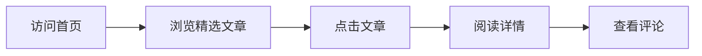

## 1. Product Overview
一个现代化的个人主页/博客网站，用于展示个人信息、技术文章和作品集。目标用户为开发者、设计师和内容创作者，提供优雅的阅读体验和个人品牌展示平台。

## 2. Core Features

### 2.1 User Roles
| Role | Registration Method | Core Permissions |
|------|---------------------|------------------|
| Visitor | No registration | Browse all content, read articles |

### 2.2 Feature Module
1. **Home page**: Hero section, navigation, featured articles, recent posts
2. **About page**: Personal introduction, skills, experience timeline
3. **Blog page**: Article list with categories, pagination, search
4. **Article detail page**: Full article content, comments section

### 2.3 Page Details
| Page Name | Module Name | Feature description |
|-----------|-------------|---------------------|
| Home page | Hero section | Animated text, profile image, social links |
| Home page | Featured articles | 3 highlighted articles with cover images |
| Home page | Recent posts | List of latest 5 articles |
| About page | Profile | Personal bio, skills tags, contact info |
| About page | Timeline | Professional experience timeline |
| Blog page | Article list | Filter by category, pagination, search |
| Blog detail | Content | Markdown rendering, code highlighting |
| Blog detail | Comments | Disqus or custom comment system |

## 3. Core Process
用户访问首页 → 浏览精选文章 → 点击感兴趣的文章 → 阅读详情 → 查看评论

## 4. User Interface Design

### 4.1 Design Style
- **Primary color**: Deep blue (#1e3a8a) - professional, trustworthy
- **Secondary color**: Emerald green (#10b981) - accent for CTAs
- **Background**: Light gray gradient (#f8fafc to #e2e8f0)
- **Button style**: Rounded corners (8px), subtle shadows, hover transitions
- **Font**: Serif display font (Playfair Display) + Sans-serif body (Inter)
- **Layout**: Clean card-based design with generous whitespace
- **Icons**: Lucide React - minimal line style

### 4.2 Page Design Overview
| Page Name | Module Name | UI Elements |
|-----------|-------------|-------------|
| Home page | Hero | Large title with animated gradient text, circular profile image, social icons |
| Home page | Featured articles | Card with overlay gradient, category badge, read time |
| Blog page | Filter | Category tabs with active state, search input with icon |
| Article detail | Content | Responsive typography, code blocks with syntax highlighting |

### 4.3 Responsiveness
- Desktop-first approach
- Mobile: Stacked layout, hamburger menu for navigation
- Tablet: Medium grid layout, collapsed sidebar
- Touch optimization: Larger tap targets, swipe gestures for carousel

### 4.4 Animations
- Page load: Staggered fade-in animations
- Scroll: Parallax effect on hero section
- Hover: Card scale, button color transition
- Navigation: Smooth scroll behavior