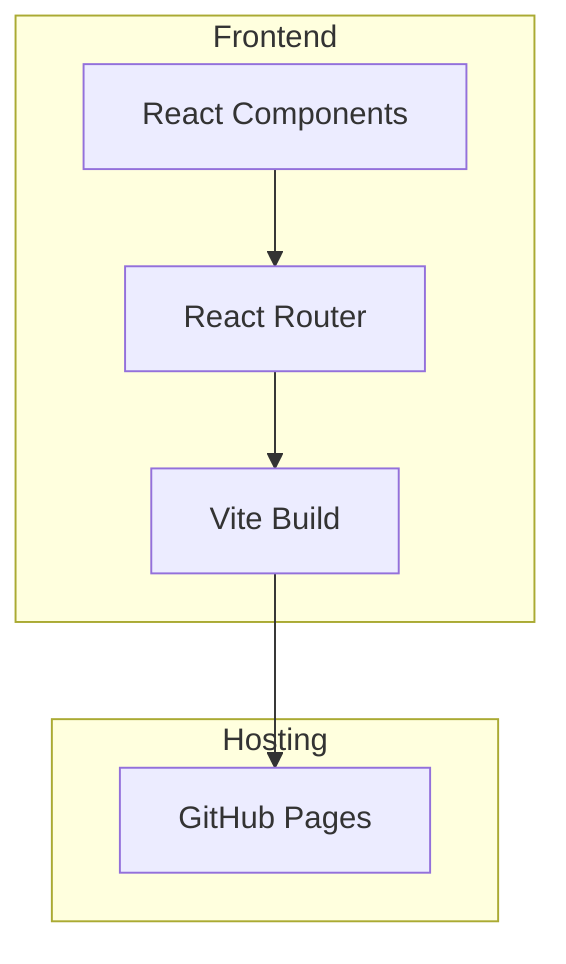

## 1. Architecture Design


## 2. Technology Description
- Frontend: React@18 + TypeScript + TailwindCSS@3 + Vite
- Routing: React Router DOM@6
- Icons: Lucide React
- Markdown: React Markdown + Rehype Highlight
- Build Tool: Vite@6
- Hosting: GitHub Pages

## 3. Route Definitions
| Route | Purpose | Component |
|-------|---------|-----------|
| / | Home page with hero and featured articles | Home.tsx |
| /about | Personal information and skills | About.tsx |
| /blog | Article list with filters | Blog.tsx |
| /blog/:slug | Individual article detail | ArticleDetail.tsx |

## 4. Project Structure
```
src/
├── components/
│   ├── layout/
│   │   ├── Header.tsx
│   │   ├── Footer.tsx
│   │   └── Layout.tsx
│   ├── home/
│   │   ├── Hero.tsx
│   │   ├── FeaturedArticles.tsx
│   │   └── RecentPosts.tsx
│   ├── blog/
│   │   ├── ArticleCard.tsx
│   │   ├── CategoryFilter.tsx
│   │   └── CommentSection.tsx
│   └── common/
│       ├── SocialLinks.tsx
│       └── Tag.tsx
├── pages/
│   ├── Home.tsx
│   ├── About.tsx
│   ├── Blog.tsx
│   └── ArticleDetail.tsx
├── data/
│   └── articles.ts
├── utils/
│   └── helpers.ts
├── styles/
│   └── globals.css
├── App.tsx
├── main.tsx
└── index.css
```

## 5. Data Model
### 5.1 Article Model
```typescript
interface Article {
  id: string;
  slug: string;
  title: string;
  excerpt: string;
  content: string;
  coverImage: string;
  category: string;
  tags: string[];
  author: string;
  readTime: number;
  date: string;
}
```

### 5.2 Category Model
```typescript
interface Category {
  id: string;
  name: string;
  slug: string;
  count: number;
}
```

## 6. Build Configuration
- Vite config with GitHub Pages base path support
- TailwindCSS with custom color palette
- TypeScript strict mode enabled
- Production build optimized for GitHub Pages